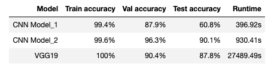

#  Capstone: Classification of Singapore Road Traffic Signs

### Overview

Traffic sign classification is the process of automatically recognizing traffic signs along the road, such as speed limit signs, give-way signs, merge signs, etc. Being able to automatically recognize traffic signs enables us to build “smarter cars”.

### Problem Statement

This project is focused on the development of a multi-class, single-image classification model using Neural Network to recognise road traffic signs in Singapore.

### Datasets

Training dataset: comprises of 32 classes of traffic signs with 1954 images 
Validation dataset: comprises of 32 classes of traffic signs with 939 images 
Test dataset: comprises of 32 classes of traffic signs with 352 images

### Executive Summary

This project seeks to create a Singapore road traffic signs classification model using Neural Network.

The work was done in jupyter notebook on personal laptop. The notebook is focused on data import/visualisation, EDA, preprocessing using Keras ImageDataGenerator class, building and evaluating of models for the classification problem.

Results of the models performance as below,

After analysis of all the models performance and time required for the training process, CNN Model_2 was chosen as my final model used for predicting on the unseen test dataset.

The CNN Model_1 has the poorest generalisation among the three models. Although the VGG19 model has the highest training accuracy, its generalisation paled in comparison to CNN Model_2. Moreover, VGG19 is taking way much longer to train than the other two models. On the other hand, CNN Model_2 has the highest validation of 96.3% and test accuracy 90.1%. So, we can conclude that CNN Model_2 is doing a fairly good job in predicting the classes of traffic signs.

### Conclusions and Recommendations

We can see that the model_2 has achieved an accuracy score of 90%. In the pre-processing phase, we use the image data-generator features of Tensorflow to perform data augmentation, as well as train/validation split. A test set, containing more background clutter and other variances, was used to evaluate our trained model on unseen images.

Model_1 was a basic convolutional neural network consisting of 1 Conv2D layer with 32 filters, connected to dense hidden layer of 32 units, then followed by output dense layer of 32 units to reflect the categorical classification of the 32 classes. Even though the training accuracy achieved 99.4%, it's test accuracy was only 60.8%, suggesting that insufficient network capacity was more of an issue than overfitting.

Model_2 was a more fully connected network with 4 Conv2D and max-pooling layers to down-sample the feature map outputs from respective convolutional layers. This is followed by 3 more hidden dense layers with accompanying dropout layers as a form of regularisation to mitigate our model from overfitting. Early stop criteria was set to monitor training loss for stagnant over 5 epoch, but was never triggered. Lastly all 3 accuracy metrics are well within 10% deviation of each other.

The 3rd model, which is a VGG-19 pre-trained model, comprises of 5 Conv2D and max-pooling layers followed by output dense layer of 32 units. Early stop criteria was also set to monitor training loss for stagnant over 5 epoch, but was never triggered. Even though the training accuracy achieved 100%, it's validation and test accuracy was only 90.4% and 87.8% respectively, suggesting that more training passes might improve the model's performance.

Out of the 352 images of traffic signs, all of them have been successfully classified except for 35 images which has been miss-classified. This results substantiate that the model has successfully classified around 90% of all the images. Therefore, it can be concluded that the model predicts all 32 classes quite well although not perfectly.

Areas for expansion and future exploration:

- To include more training images of traffic signs that are not so tightly cropped.
- To expand the dataset further, as Singapore has a total of more than 80 classes of traffic signs.
- To have the models run more epochs if time is not a constraint
